# VolaBot N8N Workflow Architecture

This diagram visualizes the complete VolaBot workflow system - an AI-powered travel consultant that provides curated hotel recommendations through sophisticated data analysis from multiple sources.

## System Overview

- **7 Properties**: Always returns exactly 7 accommodations
- **5-2 Platform Ratio**: 5 Booking.com + 2 Airbnb properties
- **Review Analysis**: Up to 500 reviews per property with sentiment analysis
- **Google Maps Integration**: Enhanced validation and amenity verification
- **Multi-Language Support**: Automatic language detection and translation

## Workflow Architecture

```mermaid
flowchart TD
    %% Input Layer
    A[📱 Chat Trigger<br/>When chat message received] --> B[⚡ Vola Webhook<br/>External API endpoint]
    B --> C[✏️ Edit Fields<br/>Data processing & transformation]

    %% Central Intelligence Layer
    C --> D[🤖 AI Agent<br/>VolaBot Travel Consultant<br/>Sophisticated AI Persona]

    %% AI Infrastructure
    D -.-> E[🧠 Google Gemini Chat Model<br/>gemini-1.5-flash<br/>Natural Language Processing]
    D -.-> F[🗄️ PostgreSQL Chat Memory<br/>hotels_agent table<br/>Session Persistence]

    %% Business Logic Decision Point
    D --> G{🎯 Request Analysis<br/>Extract: destination, dates,<br/>budget, preferences}

    %% Tool Orchestration Layer
    G -->|Parallel Data Collection| H[🏨 Scrape Booking<br/>voyager~booking-scraper<br/>Accommodation Data]
    G -->|Parallel Data Collection| I[🏠 Scrape Airbnb<br/>tri_angle~airbnb-scraper<br/>Accommodation Data]
    G -->|Review Analysis| J[📝 Reviews Booking<br/>voyager~booking-reviews-scraper<br/>Up to 500 reviews]
    G -->|Review Analysis| K[📝 Reviews Airbnb<br/>tri_angle~airbnb-reviews-scraper<br/>Up to 500 reviews]
    G -->|Validation & Enhancement| L[🗺️ Google Maps Reviews<br/>compass~google-maps-reviews-scraper<br/>25 reviews per property]
    G -->|Additional Validation| M[🗺️ JUST Google Maps Reviews<br/>Additional Google Maps integration<br/>Amenity verification]

    %% Data Processing Layer
    H --> N[⚙️ Property Curation Algorithm<br/>Unified ranking & quality scoring<br/>Budget-based filtering]
    I --> N
    J --> O[📊 Review Analysis Engine<br/>3-4 positives + 2 negatives<br/>Traveler type segmentation]
    K --> O
    L --> P[✅ Google Maps Enhancement<br/>Rating validation & boost<br/>Amenity verification]
    M --> P

    %% Business Logic Enforcement
    N --> Q{🎲 5-2 Platform Ratio<br/>Enforcement Algorithm}
    Q -->|5 Properties| R[🏨 Booking.com Selection<br/>Top quality properties<br/>Budget-appropriate]
    Q -->|2 Properties| S[🏠 Airbnb Selection<br/>Unique experiences<br/>Local authenticity]

    %% Quality Gates
    R --> T[🖼️ Image Curation<br/>Max 3 per property<br/>User preference matching]
    S --> T
    O --> U[📝 Content Generation<br/>Language consistency<br/>Sophisticated writing style]
    P --> U
    T --> U

    %% Final Processing
    U --> V[🎯 Quality Validation<br/>Exactly 7 properties<br/>Link integrity check]
    V --> W[📤 Respond to Webhook<br/>Formatted recommendations<br/>Booking links included]

    %% External APIs
    H -.->|API Call| X[🔗 Apify API<br/>Booking.com Data<br/>Language: ro, Currency: varies]
    I -.->|API Call| Y[🔗 Apify API<br/>Airbnb Data<br/>Date format: ISO YYYY-MM-DD]
    J -.->|API Call| Z[🔗 Apify API<br/>Review Data<br/>Sentiment analysis ready]
    K -.->|API Call| AA[🔗 Apify API<br/>Review Data<br/>Multi-language support]
    L -.->|API Call| BB[🔗 Apify API<br/>Google Maps Data<br/>Cost optimized: 25 reviews]
    M -.->|API Call| CC[🔗 Apify API<br/>Additional Maps Data<br/>Amenity verification]

    %% Style Definitions
    classDef inputStyle fill:#4a90e2,stroke:#2171b5,stroke-width:2px,color:#fff
    classDef aiStyle fill:#5cb85c,stroke:#449d44,stroke-width:2px,color:#fff
    classDef toolStyle fill:#d9534f,stroke:#c9302c,stroke-width:2px,color:#fff
    classDef processStyle fill:#f0ad4e,stroke:#ec971f,stroke-width:2px,color:#fff
    classDef outputStyle fill:#5bc0de,stroke:#46b8da,stroke-width:2px,color:#fff
    classDef apiStyle fill:#6f42c1,stroke:#5a32a3,stroke-width:2px,color:#fff

    %% Apply Styles
    class A,B,C inputStyle
    class D,E,F aiStyle
    class H,I,J,K,L,M toolStyle
    class G,N,O,P,Q,R,S,T,U,V processStyle
    class W outputStyle
    class X,Y,Z,AA,BB,CC apiStyle
```



## Key Technical Parameters

### Critical API Parameters
- **flexibility_window**: Only valid values: `"0"`, `"1"`, `"2"`, `"7"`
- **language**: Hardcoded to `"ro"` for scraper tools, user language for responses
- **date_format**: ISO format required (YYYY-MM-DD)
- **currency**: User-specified or inferred (EUR, USD, RON)
- **max_reviews**: 25 for Google Maps (cost optimization ~$15/month)

### Business Logic Constraints
- **Property Count**: Exactly 7 properties (mandatory)
- **Platform Distribution**: 5 Booking.com + 2 Airbnb (strict ratio)
- **Review Analysis**: 3-4 positives + 2 negatives with explanations
- **Image Curation**: Maximum 3 high-quality, distinct images per property
- **Quality Thresholds**: Budget-based filtering with minimum ratings

### Data Flow Timing
1. **User Request**: Instant webhook trigger
2. **Parameter Extraction**: ~5-10 seconds (AI processing)
3. **Data Collection**: ~3-5 minutes (parallel scraping)
4. **Analysis & Curation**: ~1-2 minutes (review processing, ranking)
5. **Response Generation**: ~30 seconds (formatting, translation)
6. **Total Process Time**: ~5-8 minutes end-to-end

## Integration Points

### Database Schema
```sql
-- PostgreSQL Chat Memory Table
CREATE TABLE hotels_agent (
    id SERIAL PRIMARY KEY,
    session_id VARCHAR(255),
    message_content TEXT,
    role VARCHAR(50),
    timestamp TIMESTAMP DEFAULT CURRENT_TIMESTAMP
);
```

### Webhook Configuration
- **Input**: N8N chat interface + external API endpoint
- **Output**: Formatted JSON response with property recommendations
- **Authentication**: API key-based (configured in N8N credentials)

## Quality Assurance Framework

### Automated Validation
- ✅ Parameter format validation before API calls
- ✅ Response data structure validation
- ✅ Link integrity verification
- ✅ Language consistency checks
- ✅ Platform ratio enforcement
- ✅ Property count validation (exactly 7)

### Manual Testing Checkpoints
1. **Input Processing**: Verify parameter extraction accuracy
2. **Tool Integration**: Confirm all scrapers return valid data
3. **Business Logic**: Validate 5-2 ratio enforcement
4. **Content Quality**: Review writing style and language consistency
5. **Output Format**: Check link integrity and response structure

---

*This diagram represents the production VolaBot workflow as implemented in `Hotels-Agent-CRISTI.json` - a sophisticated AI travel consultant system providing curated accommodation recommendations through multi-source data analysis and intelligent curation algorithms.*
